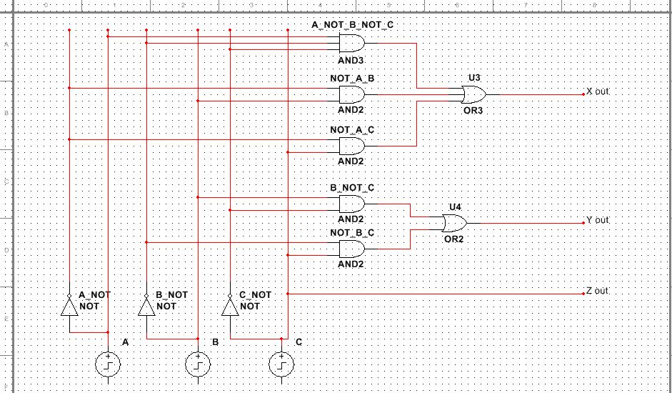
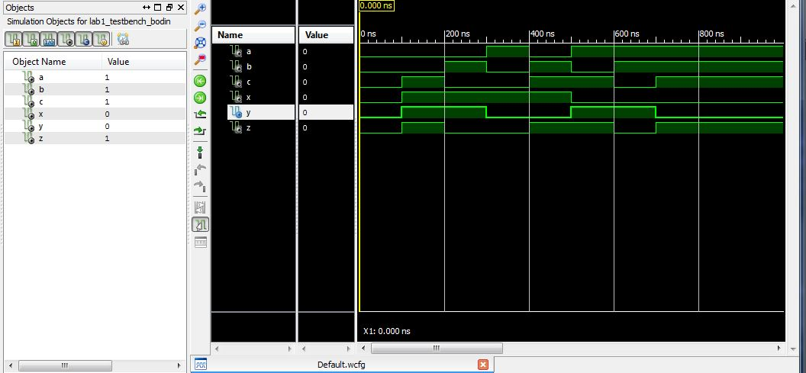

ECE281_Lab1
===========

##Truth Table and Simulation Results

### Theoretical Truth Table

| A | B | C | X | Y | Z |
|---|---|---|---|---|---|
| 0 | 0 | 0 | 0 | 0 | 0 |
| 0 | 0 | 1 | 1 | 1 | 1 |
| 0 | 1 | 0 | 1 | 1 | 0 |
| 0 | 1 | 1 | 1 | 0 | 1 |
| 1 | 0 | 0 | 1 | 0 | 0 |
| 1 | 0 | 1 | 0 | 1 | 1 |
| 1 | 1 | 0 | 0 | 1 | 0 |
| 1 | 1 | 1 | 0 | 0 | 1 |

### Simulated Truth Table

| A | B | C | X | Y | Z |
|---|---|---|---|---|---|
| 0 | 0 | 0 | 0 | 0 | 0 |
| 0 | 0 | 1 | 1 | 1 | 1 |
| 0 | 1 | 0 | 1 | 1 | 0 |
| 0 | 1 | 1 | 1 | 0 | 1 |
| 1 | 0 | 0 | 1 | 0 | 0 |
| 1 | 0 | 1 | 0 | 1 | 1 |
| 1 | 1 | 0 | 0 | 1 | 0 |
| 1 | 1 | 1 | 0 | 0 | 1 |

The simulated results nicely match what I predicted in the truth table.
This would imply the boolean expressions generated from the K-maps 
worked as expected. One thing I might have done differently would be
to reduce the number of signals in my code. Specifcally I could've replaced
the A_NOT, B_NOT, and C_NOT signals with a simpl "not a;". I don't know
what the convention is though. 

##Schematic

##Simulation Screenshot

##Design Implementation for 3bit
A programming file was uploaded to the NEXYS 2 device and all cases were tested
by toggling the switches and comparing the inputs and outputs to the theoretical
truthtable generated at the begining of the lab. The device generated the 
correct output in all cases. 

##Design Implementation for 8bit
8bit functionality was added to the project through the use of STD_LOGIC_VECTORS and
the arithematic library. An input and output bus of 8 bits was defined and configured
to use the correct toggles and led's in the .ucf. The algorithm for 2's complement can be
summarized as NOTing all the inputs and then adding one. This was implemented in the 
following line: 

    outputs <= STD_LOGIC_VECTOR(SIGNED(not inputs) + 1 );
    
##Functionality
3Bit functionality was successfully demonstrated on 23 January during class.

8Bit functionality was successfully demonstrated on 27 January during class. 
    
##Documentation 
Dr. Neebel

Capt. Silva

[Object Mix Forum](http://objectmix.com/vhdl/190708-how-do-perform-std_logic_vector-addition-using-ieee-numeric_std.html)

[Stack Overflow](http://stackoverflow.com/questions/15336875/vhdl-std-logic-vector-indexing-with-downto)
    
